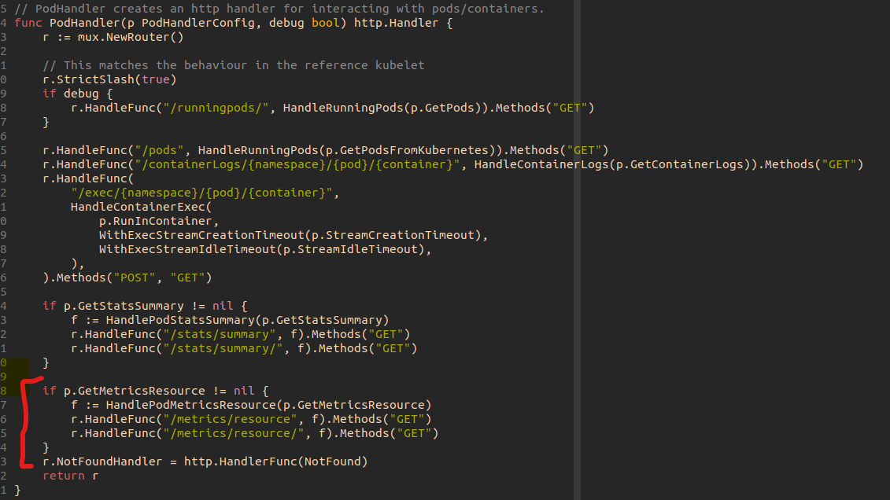
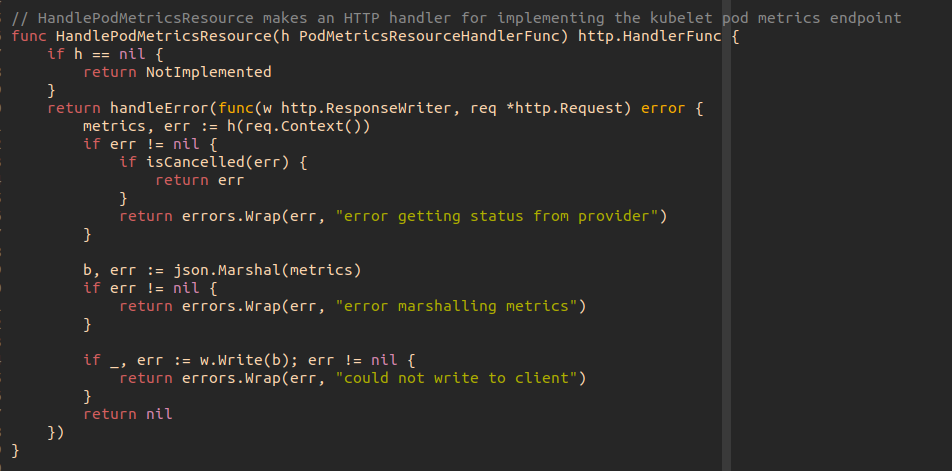
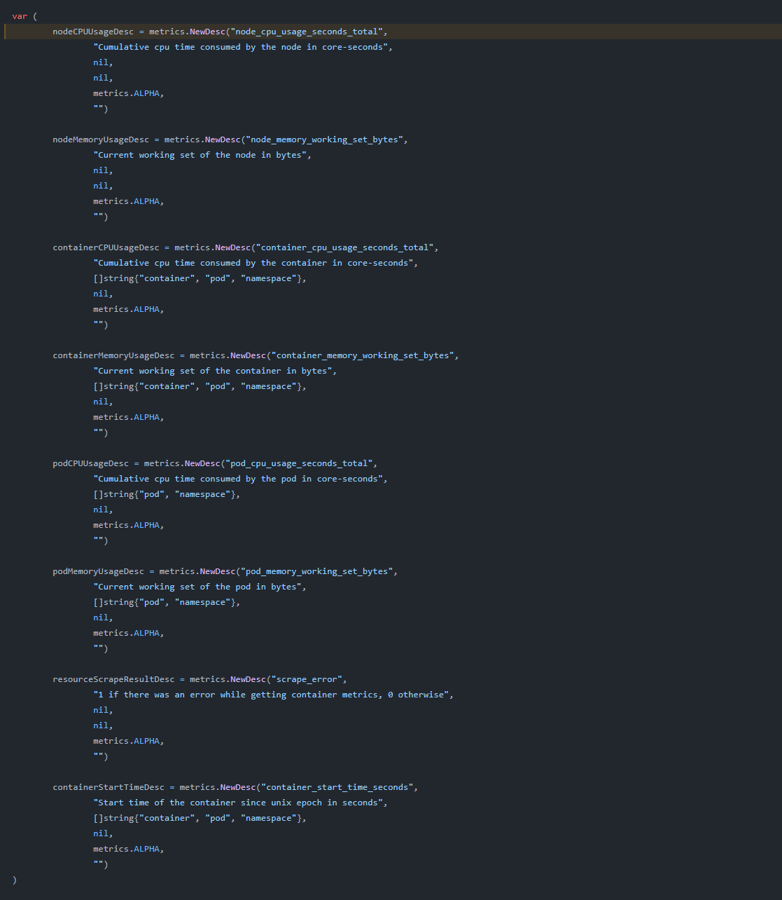

#  Virtual Kubelet Metrics Update

<!-- toc -->
- [Summary](#summary)
- [Motivation](#motivation)
  - [Goals](#goals)
  - [Non-Goals](#non-goals)
- [Proposal](#proposal)
- [Design Details](#design-details)
  - [API](#api)
  - [Data](#data)
  - [Changes to the Provider](#changes-to-the-provider)
  - [Test Plan](#test-plan)
<!-- /toc -->

## Summary

Add the new /metrics/resource endpoint in the virtual-kubelet to support the metrics server update for new Kubernetes versions `>=1.24`


## Motivation

The Kubernetes metrics server now tries to get metrics from the kubelet using the new metrics endpoint [/metrics/resource](https://github.com/kubernetes-sigs/metrics-server/commit/a2d732e5cdbfd93a6ebce221e8df0e8b463eecc6#diff-6e5b914d1403a14af1cc43582a2c9af727113037a3c6a77d8729aaefba084fb5R88),
while Virtual Kubelet is still exposing the earlier metrics endpoint [/stats/summary](https://github.com/virtual-kubelet/virtual-kubelet/blob/master/node/api/server.go#L90). 
This causes metrics to break when using virtual kubelet with newer Kubernetes versions (>=1.24). 
To support the new metrics server, this document proposes adding a new handler to handle the updated metrics endpoint. 
This will be an additive update, and the old 
[/stats/summary](https://github.com/virtual-kubelet/virtual-kubelet/blob/master/node/api/server.go#L90) endpoint will still be available to maintain backward compatibility with 
the older metrics server version.


### Goals

- Support metrics for kubernetes version `>=1.24` through adding /metrics/resource endpoint handler.

### Non-Goals

- Ensure pod autoscaling works as expected with the newer kubernetes versions `>=1.24` as expected

## Proposal

Add a new handler for `/metrics/resource` endpoint that calls a new `GetMetricsResource` method in the provider,
which in-turn returns metrics using the prometheus `model.Samples` data structure as expected by the new metrics server.
The provider will need to implement the `GetMetricsResource` method in order to add support for the new `/metrics/resource` endpoint with Kubernetes version >=1.24


## Design Details
Currently the virtual kubelet code uses the `PodStatsSummaryHandler` method to set up a http handler for serving pod metrics via the `/stats/summary` endpoint. 
To support the updated metrics server, we need to add another handler `PodMetricsResourceHandler`  which can serve metrics via the `/metrics/resource` endpoint. 
The `PodMetricsResourceHandler` calls the new `GetMetricsResource` method of the provider to get the metrics from the specific provider. 

### API
Add `GetMetricsResource` to `PodHandlerConfig`

 
Add endpoint to `PodHandler` method 


  
New `PodMetricsResourceHandler` method, that uses the new `PodMetricsResourceHandlerFunc` definition.


 
 
`HandlePodMetricsResource` method

 
 
The `PodMetricsResourceHandlerFunc` returns the metrics data using Prometheus' `MetricFamily` data structure. More details are provided in the Data subsection

 
### Data

The updated metrics server does not add any new fields to the metrics data but uses the Prometheus textparse series parser to parse and reconstruct the [MetricsBatch](https://github.com/kubernetes-sigs/metrics-server/blob/83b2e01f9825849ae5f562e47aa1a4178b5d06e5/pkg/storage/types.go#L31) data structure.  
Currently virtual-kubelet is sending data to the server using the [summary](https://github.com/virtual-kubelet/virtual-kubelet/blob/be0a062aec9a5eeea3ad6fbe5aec557a235558f6/node/api/statsv1alpha1/types.go#L24) data structure. The Prometheus text parser expects a series of bytes as in the Prometheus [model.Samples](https://github.com/kubernetes/kubernetes/blob/a93eda9db305611cacd8b6ee930ab3149a08f9b0/vendor/github.com/prometheus/common/model/value.go#L184) data structure, similar to the test [here](https://github.com/prometheus/prometheus/blob/c70d85baed260f6013afd18d6cd0ffcac4339861/model/textparse/promparse_test.go#L31).
 
Examples of how the new metrics data should look can be seen in the Kubernetes e2e test that calls the /metrics/resource endpoint [here](https://github.com/kubernetes/kubernetes/blob/a93eda9db305611cacd8b6ee930ab3149a08f9b0/test/e2e_node/resource_metrics_test.go#L76), and the kubelet metrics defined in the Kubernetes/kubelet code [here](https://github.com/kubernetes/kubernetes/blob/master/pkg/kubelet/metrics/collectors/resource_metrics.go) .
 
 

 
 
 
The kubernetes/kubelet code implements Prometheus' [collector](https://github.com/kubernetes/kubernetes/blob/master/pkg/kubelet/metrics/collectors/resource_metrics.go#L88) interface which is used along with the k8s.io/component-base implementation of the [registry](https://github.com/kubernetes/component-base/blob/40d14bdbd62f9e2ea697f97d81d4abc72839901e/metrics/registry.go#L114) interface in order to collect and return the metrics data using the Prometheus' [MetricFamily](https://github.com/prometheus/client_model/blob/master/go/metrics.pb.go#L773) data structure.
 
The Gather method in the registry calls the kubelet collector's Collect method, and returns the data u the MetricFamily data structure.


Prometheus’ MetricsFamily data structure:  


Therefore the provider's GetMetricsResource method should use the same return type as the Gather method in the registry interface.
 
### Changes to the Provider.

In order to support the new metrics endpoint the Provider must implement the GetMetricsResource method with definition

```golang

import (
  dto "github.com/prometheus/client_model/go"
  "context"
)

func GetMetricsResource(context.Context) ([]*dto.MetricsFamily, error) {
...
}
```

### Test Plan

- Write a provider implementation for GetMetricsResource method in ACI Provider and deploy pods get metrics using kubectl 
- Run end-to-end tests with the provider implementation

